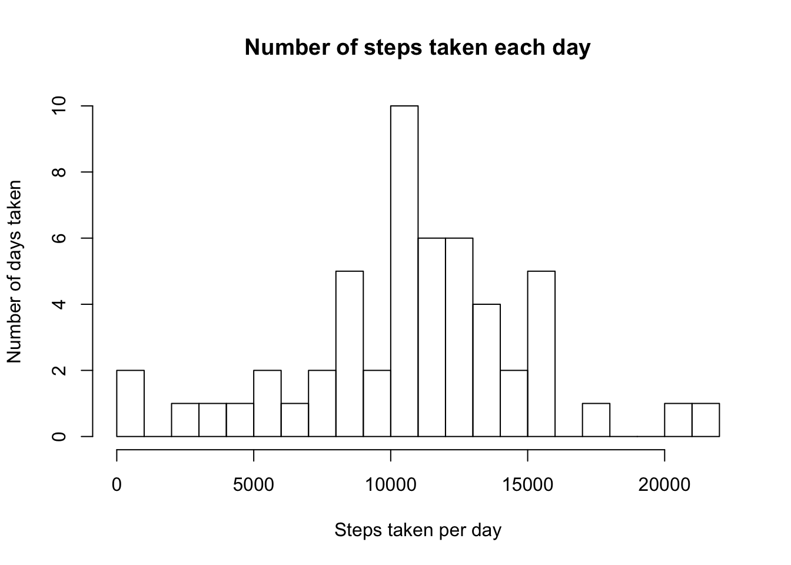
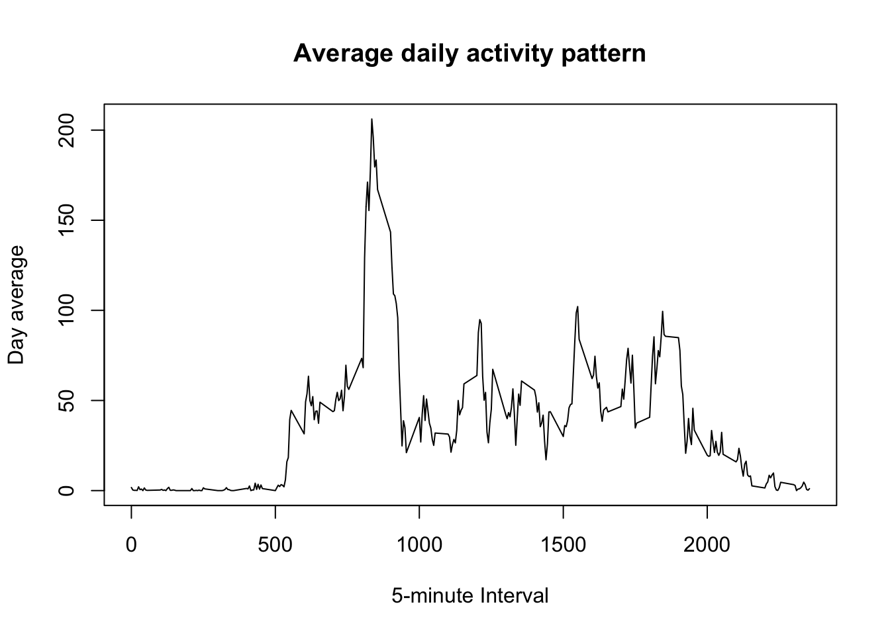
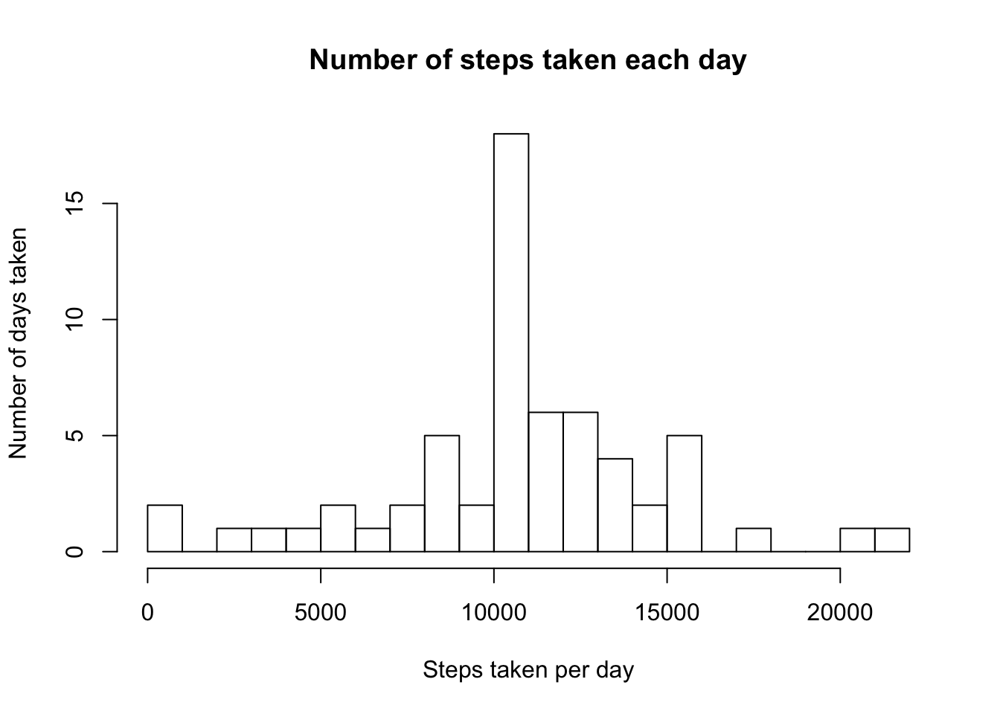
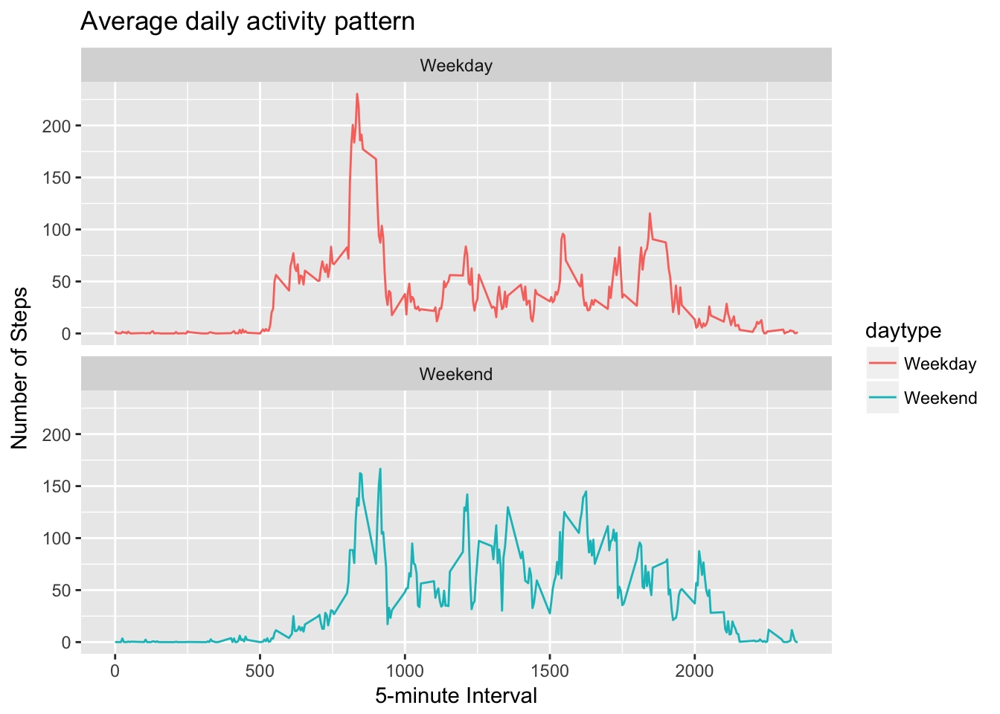

# Reproducible Research Peer Assessment 1


## A. Loading and preprocessing the data

#### 1. Load the data

* The data is downloaded from the given URL:  https://d396qusza40orc.cloudfront.net/repdata%2Fdata%2Factivity.zip  
* The resulted zip is stored in a temporary file while the .csv is being extracted.  
  

```r
activityURL <- "https://d396qusza40orc.cloudfront.net/repdata%2Fdata%2Factivity.zip"
temp <- tempfile()
download.file(activityURL, temp)
unzip(temp, "activity.csv")
activity <- read.csv("activity.csv", header = TRUE)
unlink(temp)
```
  
#### 2. Process/transform the data (if necessary) into a format suitable for your analysis
  
* The date column is formated accordingly.  
  

```r
activity <- data.frame(activity)
activity$date <- as.Date(activity$date, "%Y-%m-%d")
```
  
## B. What is mean total number of steps taken per day?
  
* For this part of the assignment, you can ignore the missing values in the dataset.
  
#### 1. Calculate the total number of steps taken per day
  
* Sum for the steps for each data has been recorded.
  

```r
totalStepsDay <- aggregate(steps ~ date, data = activity, FUN = sum, na.rm = TRUE)
```
  
#### 2. Histogram of the total number of steps taken each day
  
If you do not understand the difference between a histogram and a barplot, research the difference between them.  
Make a histogram of the total number of steps taken each day. 
  
* Plot an histogram for the total number of steps per day calculated
  

```r
hist(totalStepsDay$steps, xlab = "Steps taken per day", ylab = "Number of days taken", main = "Number of steps taken each day", breaks = 25)
```


  
#### 3. Calculate and report the mean and median of the total number of steps taken per day
  
* Calculate the values asked using the proper function and corroborate using summaries
  

```r
mean(totalStepsDay$steps)
```

```
## [1] 10766.19
```

```r
median(totalStepsDay$steps)
```

```
## [1] 10765
```

```r
summary(totalStepsDay$steps)
```

```
##    Min. 1st Qu.  Median    Mean 3rd Qu.    Max. 
##      41    8841   10760   10770   13290   21190
```
  
## C. What is the average daily activity pattern?
  
#### 1. Make a time series plot of the 5-minute interval (x-axis) and the average number of steps taken, averaged across all days (y-axis)
  
* Aggregate steps data by intervals and calculate the average
* Plot using a line as format
  

```r
minuteInterval <- aggregate (steps ~ interval, data = activity, FUN = mean, na.rm = TRUE)
plot(x = minuteInterval$interval, y = minuteInterval$steps, type = "l", xlab = "5-minute Interval", ylab = "Day average", main = "Average daily activity pattern")
```


  
#### 2. Which 5-minute interval, on average across all the days in the dataset, contains the maximum number of steps?
  
* Calculate the maximum of the aggregate data by 5-minute intervals
  

```r
maxInterval <- minuteInterval$interval[which.max(minuteInterval$steps)]
maxInterval
```

```
## [1] 835
```
  
## D. Imputing missing values
  
Note that there are a number of days/intervals where there are missing values (coded as NAs). The presence of missing days may introduce bias into some calculations or summaries of the data.
  
#### 1. Calculate and report the total number of missing values in the dataset (i.e. the total number of rows with NAs)
  
* Sum the number of missing steps per day per interval (these two cannot be NAs)
  

```r
totalNAS <- sum(is.na(activity$steps))
totalNAS
```

```
## [1] 2304
```
  
#### 2. Devise a strategy for filling in all of the missing values in the dataset.
  
The strategy does not need to be sophisticated. For example, you could use the mean/median for that day, or the mean for that 5-minute interval, etc.
  
* Calculate the mean for each 5-minute interval to replace the missing values
  

```r
intervalAVG <- tapply(activity$steps, activity$interval, mean, na.rm=TRUE, simplify = TRUE)
```
  
#### 3. Create a new dataset that is equal to the original dataset but with the missing data filled in.
  
* Use the calculated means to fulfill the values
* Check there are not NAs
  

```r
activityImputed <- data.table(activity)
activityNAS <- is.na(activity$steps)
activityImputed$steps[activityNAS] <- intervalAVG[as.character(activity$interval[activityNAS])]
sum(is.na(activityImputed))
```

```
## [1] 0
```
  
#### 4. Make a histogram of the total number of steps taken each day.
  
* Repeat the same process with the new database


```r
totalStepsDayImputed <- aggregate(steps ~ date, data = activityImputed, FUN = sum, na.rm = TRUE)
hist(totalStepsDayImputed$steps, xlab = "Steps taken per day", ylab = "Number of days taken", main = "Number of steps taken each day", breaks = 25)
```


  
#### 5. Calculate and report the mean and median total number of steps taken per day. 
  
* Repeat the same process with the new database
  

```r
mean(totalStepsDayImputed$steps)
```

```
## [1] 10766.19
```

```r
median(totalStepsDayImputed$steps)
```

```
## [1] 10766.19
```

```r
summary(totalStepsDayImputed$steps)
```

```
##    Min. 1st Qu.  Median    Mean 3rd Qu.    Max. 
##      41    9819   10770   10770   12810   21190
```
  
#### 6. Do these values differ from the estimates from the first part of the assignment? 
  
* Compared values
  

```r
mean(totalStepsDayImputed$steps)-mean(totalStepsDay$steps)
```

```
## [1] 0
```

```r
median(totalStepsDayImputed$steps)-median(totalStepsDay$steps)
```

```
## [1] 1.188679
```
  
* While the median changes, because more values are added to the count, the mean stays the same as there are no differences in the numbers counted (just means have been added when there were NA values).
  
#### 7. What is the impact of imputing missing data on the estimates of the total daily number of steps?
  
* Depending on the rules/logic used to impute missing data, this impact may vary.
* In the case considered, imputting as the interval mean won't change the mean, but may vary the median as it increases the number of values with the mean - as seen in the histogram.
  
## E. Are there differences in activity patterns between weekdays and weekends?
  
For this part the weekdays() function may be of some help here. Use the dataset with the filled-in missing values for this part.
  
#### 1. Create a new factor variable in the dataset with two levels – “weekday” and “weekend” indicating whether a given date is a weekday or weekend day.
  
* Add new column to the activityImputed data table with following the ruled defined.
  

```r
activityImputed <- mutate(activityImputed, daytype = ifelse(weekdays(activityImputed$date)=="Saturday" | weekdays(activityImputed$date)=="Sunday", "Weekend", "Weekday"))
```
  
#### 2. Make a panel plot containing a time series plot of the 5-minute interval (x-axis) and the average number of steps taken, averaged across all weekday days or weekend days (y-axis). 

* Aggregate data by 5-minute interval and display and plot as previous.
* Use ggplot as it would be easier to create the asked plot.


```r
minuteIntervalDay <- aggregate(steps ~ interval + daytype, data = activityImputed, FUN = mean, na.rm = TRUE)
ggplot(minuteIntervalDay, aes(x = interval , y = steps, color = daytype)) + facet_wrap(~ daytype, ncol = 1, nrow=2) + geom_line() + labs(title =  "Average daily activity pattern", x = "5-minute Interval", y = "Number of Steps")
```


  
See the README file in the GitHub repository to see an example of what this plot should look like using simulated data.
  
